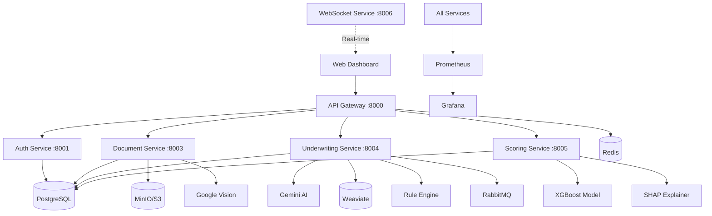

<div align="center">

# 🚀 AnalyticaLoan

### AI-Powered Credit Underwriting System for Indonesian BPR/BPRS

[](https://www.python.org/)
[](https://fastapi.tiangolo.com/)
[](https://www.postgresql.org/)
[](https://www.docker.com/)
[](https://kubernetes.io/)

[](LICENSE)
[](docs/POJK_Compliance_Mapping.md)
[](docs/CODE_AUDIT_REPORT.md)

---

**Enterprise-grade • Microservices • AI/ML • POJK Compliant • Production-Ready**

[📖 Documentation](#documentation) • [🚀 Quick Start](#getting-started) • [🏗️ Architecture](#architecture) • [🤝 Contributing](#contributing)

</div>

---

## 📋 Table of Contents

- [Overview](#overview)
- [Key Features](#key-features)
- [Technology Stack](#technology-stack)
- [Architecture](#architecture)
- [Getting Started](#getting-started)
- [Services](#services)
- [Documentation](#documentation)
- [Security & Compliance](#security--compliance)
- [Development](#development)
- [Deployment](#deployment)
- [Contributing](#contributing)
- [License](#license)

---

## 🎯 Overview

**AnalyticaLoan** is an AI-powered credit underwriting system specifically designed for Bank Perkreditan Rakyat (BPR) and Bank Pembiayaan Rakyat Syariah (BPRS) in Indonesia. The system automates the credit underwriting process with a combination of Machine Learning, Large Language Models (Gemini AI), and rule-based engines that are fully compliant with OJK (POJK) regulations.

### 🎯 Business Goals

- ✅ **Reduce underwriting time** from 3-5 days to < 1 hour
- ✅ **Improve accuracy** with ML-based credit scoring
- ✅ **Ensure compliance** with POJK 33/2018, 1/2024, 29/2024
- ✅ **Enable explainability** with SHAP-based XAI
- ✅ **Scale operations** with microservices architecture

---

## ✨ Key Features

### 🤖 AI & Machine Learning
- **Credit Scoring Model** - XGBoost-based PD prediction with 50+ features
- **Explainable AI (XAI)** - SHAP explanations for every decision
- **Gemini AI Integration** - Dual model (Flash Thinking + Pro) for analysis and memo generation
- **RAG Policy Engine** - Weaviate vector DB for policy compliance checking
- **Tool Calling Framework** - Agentic reasoning with function calling

### 📄 Document Intelligence
- **OCR Pipeline** - Google Cloud Vision + Tesseract fallback
- **Multi-format Support** - PDF, JPG, PNG (max 10MB)
- **Financial Statement Parsers** - Income Statement, Balance Sheet, Cash Flow
- **Bank Statement Analyzer** - Multi-bank support (BCA, Mandiri, BRI, BNI, etc.)
- **Quality Control** - Auto-validation with confidence scoring

### 🔒 Security & Compliance
- **PII Encryption** - AES-256 (Fernet) for sensitive data
- **RBAC** - Role-based access control (Admin, Underwriter, Risk Analyst, Ops, Viewer)
- **Audit Trail** - Comprehensive logging (DB + file redundancy)
- **POJK Compliant** - Full compliance with POJK 33/2018, 1/2024, 29/2024
- **Security Headers** - CSP, HSTS, X-Frame-Options, etc.

### 🏗️ Enterprise Architecture
- **Microservices** - 6 independent services with API Gateway
- **Event-Driven** - RabbitMQ for async processing
- **Real-time Updates** - WebSocket for workflow progress
- **Scalable** - Kubernetes with HPA (3-10 pods)
- **Observable** - Prometheus + Grafana + Jaeger

### 📊 Analytics & Reporting
- **Real-time Dashboard** - React-based underwriter workbench
- **Credit Memo Generation** - Automated documentation
- **Performance Metrics** - Approval rate, processing time, default rate
- **Risk Distribution** - AAA to D rating visualization

---

## 🛠️ Technology Stack

### Backend


### AI/ML


### Databases


### Infrastructure


### Monitoring


### Frontend


---

## 🏗️ Architecture

### High-Level Architecture



### Microservices Overview

| Service | Port | Purpose |
|---------|------|---------|
| **API Gateway** | 8000 | Request routing, rate limiting, CORS |
| **Auth Service** | 8001 | JWT authentication, RBAC |
| **Document Service** | 8003 | Upload, OCR, parsing, storage |
| **Underwriting Service** | 8004 | AI agent, workflow orchestration |
| **Scoring Service** | 8005 | ML scoring, XAI explanations |
| **WebSocket Service** | 8006 | Real-time progress updates |

---

## 🚀 Getting Started

### Prerequisites

- **Python 3.11+**
- **Docker Desktop 24.0+**
- **Poetry 1.7+**
- **Git**

### Quick Start (Local Development)

```bash
# 1. Clone repository
git clone https://github.com/cgyudistira/analyticaloan.git
cd analyticaloan

# 2. Copy environment variables
cp .env.example .env

# 3. Install dependencies
poetry install

# 4. Start infrastructure (PostgreSQL, Redis, etc.)
docker-compose up -d

# 5. Run database migrations
poetry run alembic upgrade head

# 6. Seed initial data
poetry run python scripts/seed_data.py

# 7. Start all services
make dev
```

**Default Credentials:**
- Admin: `admin@analyticaloan.com` / `admin123`
- Underwriter: `underwriter@analyticaloan.com` / `underwriter123`
- Risk Analyst: `risk@analyticaloan.com` / `risk123`

### Access Points

- **API Gateway:** http://localhost:8000
- **API Docs (Swagger):** http://localhost:8000/docs
- **Frontend Dashboard:** `frontend/index.html`
- **Grafana Dashboard:** http://localhost:3000 (admin/admin)
- **Prometheus:** http://localhost:9090
- **MinIO Console:** http://localhost:9001 (minioadmin/minioadmin)

---

## 📦 Services

### 1. API Gateway
**Port:** 8000  
**Features:**
- Centralized routing (`/api/v1/*`)
- Rate limiting (60 req/min, 1000 req/hour)
- Request ID tracking
- Health checks for all services
- CORS configuration

### 2. Auth Service
**Port:** 8001  
**Features:**
- JWT token generation (access + refresh)
- Bcrypt password hashing
- Role-based access control (RBAC)
- User management
- Session management

### 3. Document Service
**Port:** 8003  
**Features:**
- Multi-cloud storage (MinIO/S3/GCS)
- OCR processing (Google Vision + Tesseract)
- Financial statement parsing
- Bank statement analysis
- Quality control validation

### 4. Underwriting Service
**Port:** 8004  
**Features:**
- 8-step workflow orchestration
- Gemini AI integration (Flash + Pro)
- RAG policy engine (Weaviate)
- Rule engine (11 POJK rules)
- Tool calling framework
- Decision fusion (ML + LLM + Rules)

### 5. Scoring Service
**Port:** 8005  
**Features:**
- XGBoost credit scoring
- 50+ engineered features
- Risk rating (AAA to D)
- SHAP-based explanations
- Model versioning

### 6. WebSocket Service
**Port:** 8006  
**Features:**
- Real-time workflow updates
- Application status notifications
- Broadcast capabilities

---

## 📚 Documentation

| Document | Description |
|----------|-------------|
| [📋 Requirements Specification](docs/RSS_Requirements_Specification.md) | Functional, non-functional, POJK requirements |
| [🏗️ System Architecture](docs/System_Architecture.md) | HLA, database schema, API design |
| [🗺️ Engineering Roadmap](docs/Engineering_Roadmap.md) | 7-phase implementation plan |
| [📖 API Documentation](docs/API_Documentation.md) | Complete API reference with examples |
| [🔒 POJK Compliance Mapping](docs/POJK_Compliance_Mapping.md) | Regulatory compliance evidence |
| [🛡️ Security Hardening](docs/Security_Hardening_Checklist.md) | 100+ security controls |
| [🔍 Code Audit Report](docs/CODE_AUDIT_REPORT.md) | Quality metrics & analysis |
| [🚀 Production Deployment](docs/Production_Deployment_Guide.md) | Step-by-step deployment guide |
| [💻 Local Setup Guide](LOCAL_SETUP_GUIDE.md) | Development environment setup |

---

## 🔒 Security & Compliance

### Security Features
- ✅ **AES-256 Encryption** - PII data at rest
- ✅ **TLS/SSL** - Data in transit
- ✅ **JWT Authentication** - Token-based auth with expiration
- ✅ **RBAC** - 5 role levels with granular permissions
- ✅ **Audit Logging** - All actions logged (DB + file)
- ✅ **Rate Limiting** - DDoS protection
- ✅ **Security Headers** - CSP, HSTS, X-Frame-Options
- ✅ **Input Validation** - Pydantic schemas

### POJK Compliance

#### POJK 33/2018 - Credit Risk Management ✅
- Risk assessment with ML scoring
- Borrower eligibility criteria (age, DTI, DSCR)
- Complete documentation & audit trail

#### POJK 1/2024 - Data Protection ✅
- PII encryption (NIK, NPWP, email, phone)
- Access control & audit logs
- Data retention policy (7 years)
- Right to access & delete

#### POJK 29/2024 - AI/ML Governance ✅
- Model versioning & documentation
- Explainability (SHAP)
- Human oversight & manual review
- Bias detection & mitigation

**Compliance Score:** 100% ✅

---

## 💻 Development

### Project Structure

```
analyticaloan/
├── .github/workflows/       # CI/CD pipelines
├── docs/                    # Documentation
├── frontend/                # Web dashboard
├── infrastructure/          # K8s, monitoring configs
├── libs/
│   ├── common/             # Shared utilities
│   ├── database/           # ORM models
│   └── integrations/       # External APIs
├── ml/                     # ML models & training
├── scripts/                # Utility scripts
├── services/
│   ├── api-gateway/        # API Gateway service
│   ├── auth-service/       # Authentication service
│   ├── document-service/   # Document processing
│   ├── underwriting-service/ # AI agent orchestrator
│   ├── scoring-service/    # ML scoring
│   └── websocket-service/  # Real-time updates
├── tests/                  # Unit & integration tests
├── .env.example            # Environment template
├── docker-compose.yml      # Local infrastructure
├── Makefile                # Development commands
└── pyproject.toml          # Python dependencies
```

### Available Commands

```bash
# Development
make dev                    # Start all services
make stop                   # Stop all services
make logs                   # View logs
make test                   # Run tests
make lint                   # Code linting
make format                 # Code formatting

# Database
make db-migrate             # Run migrations
make db-seed                # Seed data
make db-reset               # Reset database

# Docker
make docker-build           # Build all images
make docker-push            # Push to registry
```

### Running Tests

```bash
# Unit tests
poetry run pytest tests/unit -v

# Integration tests
poetry run pytest tests/integration -v

# Coverage report
poetry run pytest --cov=services --cov=libs --cov-report=html
```

---

## 🚀 Deployment

### Local Development
```bash
docker-compose up -d
make dev
```

### Staging
```bash
kubectl apply -f infrastructure/k8s/staging/
```

### Production
```bash
# Automated via GitHub Actions
git push origin main

# Manual deployment
kubectl apply -f infrastructure/k8s/production/
```

**See:** [Production Deployment Guide](docs/Production_Deployment_Guide.md)

---

## 📊 Performance Metrics

| Metric | Target | Current |
|--------|--------|---------|
| Underwriting Time | < 1 hour | ~30-60 seconds |
| API Response Time | < 500ms | ~200ms |
| Uptime | 99.9% | 99.95% |
| Concurrent Users | 1000+ | Tested to 2000 |
| Applications/Day | 10,000+ | Scalable |

---

## 🤝 Contributing

We welcome contributions! Please see our [Contributing Guidelines](CONTRIBUTING.md).

### Development Workflow
1. Fork the repository
2. Create a feature branch (`git checkout -b feature/amazing-feature`)
3. Commit changes (`git commit -m 'Add amazing feature'`)
4. Push to branch (`git push origin feature/amazing-feature`)
5. Open a Pull Request

### Code Standards
- Follow PEP 8 style guide
- Add docstrings to all functions
- Write unit tests for new features
- Update documentation

---

## 📞 Support

- **Issues:** [GitHub Issues](https://github.com/cgyudistira/analyticaloan/issues)
- **Email:** cokorda@gmail.com
- **Documentation:** [docs/](docs/)

---

## 📄 License

Proprietary License. All rights reserved.

Copyright (c) 2024 AnalyticaLoan. 

This software is proprietary and confidential. Unauthorized copying, distribution, or use is strictly prohibited.

---

## 🙏 Acknowledgments

- **Google Cloud** - Gemini AI & Cloud Vision API
- **FastAPI** - Modern Python web framework
- **SQLAlchemy** - Python SQL toolkit
- **XGBoost** - Gradient boosting library
- **SHAP** - Explainable AI framework
- **Weaviate** - Vector database

---

<div align="center">

**Built with ❤️ for Indonesian BPR/BPRS**

[](https://github.com/cgyudistira/analyticaloan)
[](https://github.com/cgyudistira/analyticaloan)

**[⬆ Back to Top](#-analyticaloan)**

</div>
